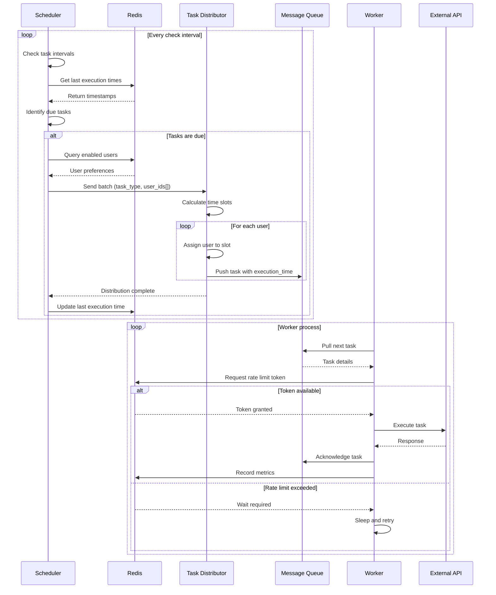
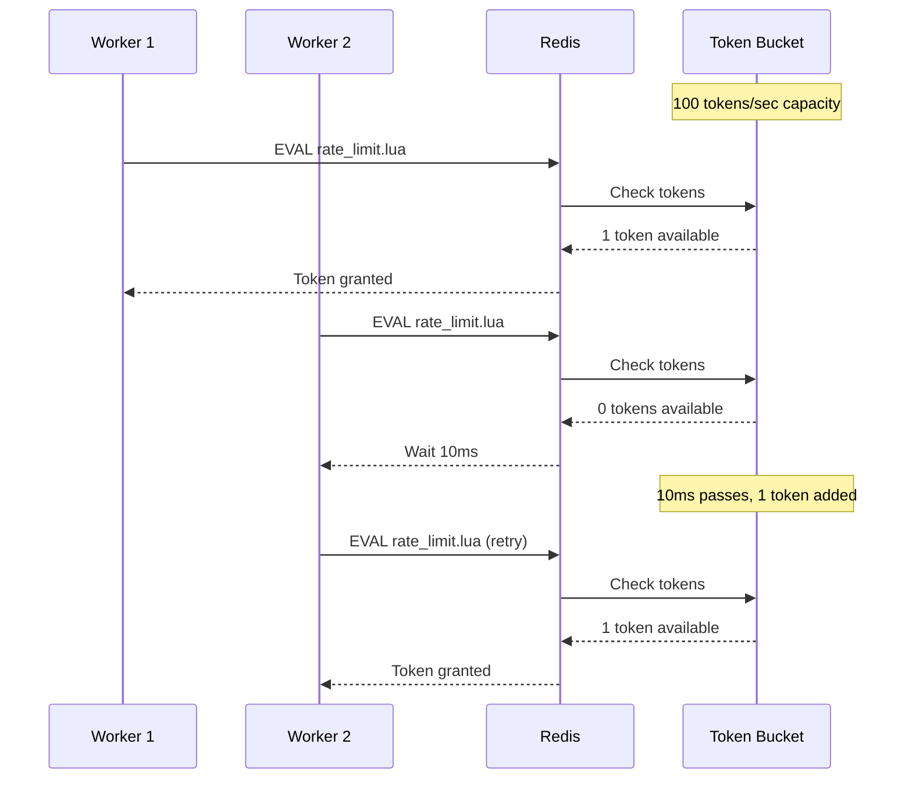
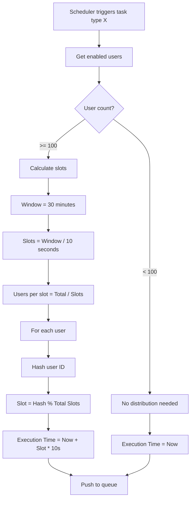
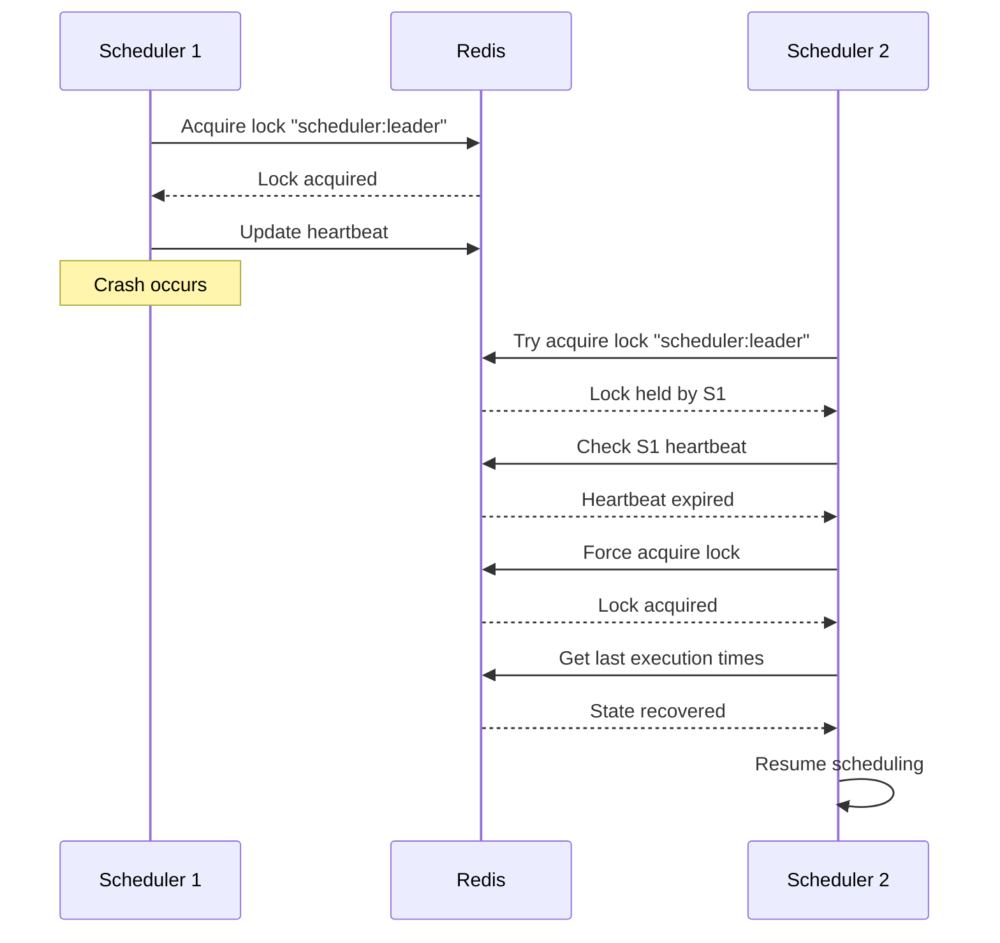
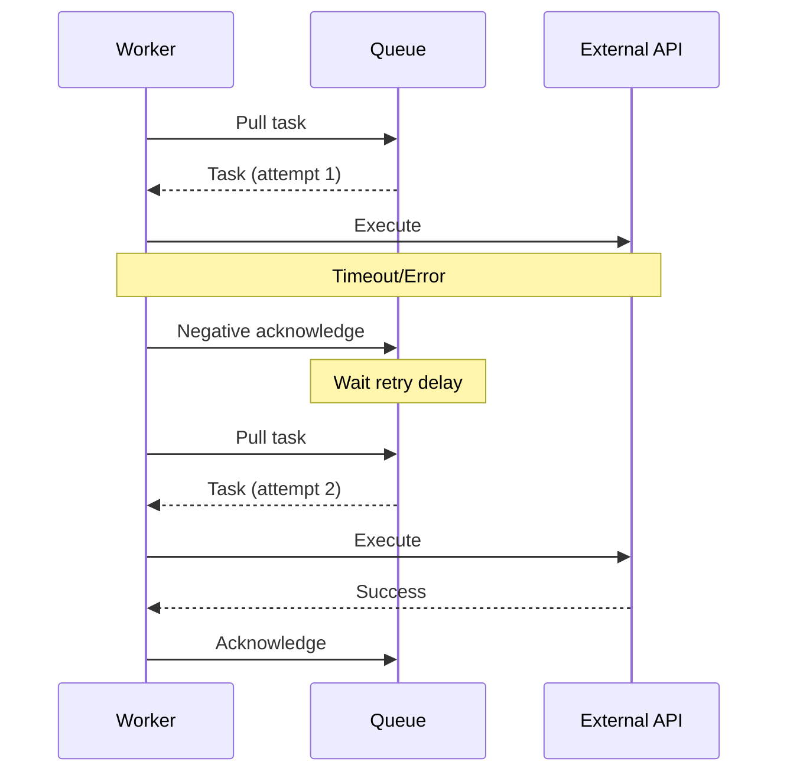
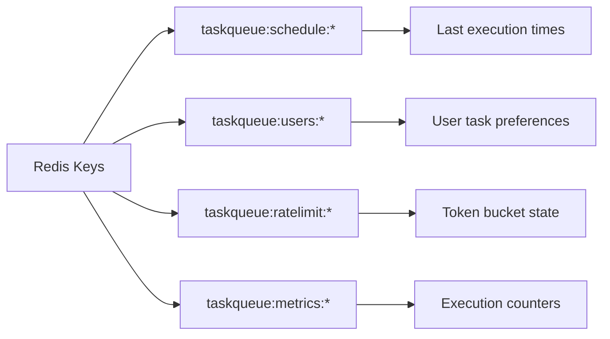

# Task Execution Sequence Diagram

## Full Task Lifecycle

## Rate Limiting Detail

## Task Distribution Algorithm

## Failure Recovery Sequences

### Scheduler Crash Recovery

### Worker Task Retry

## Redis Data Structures

